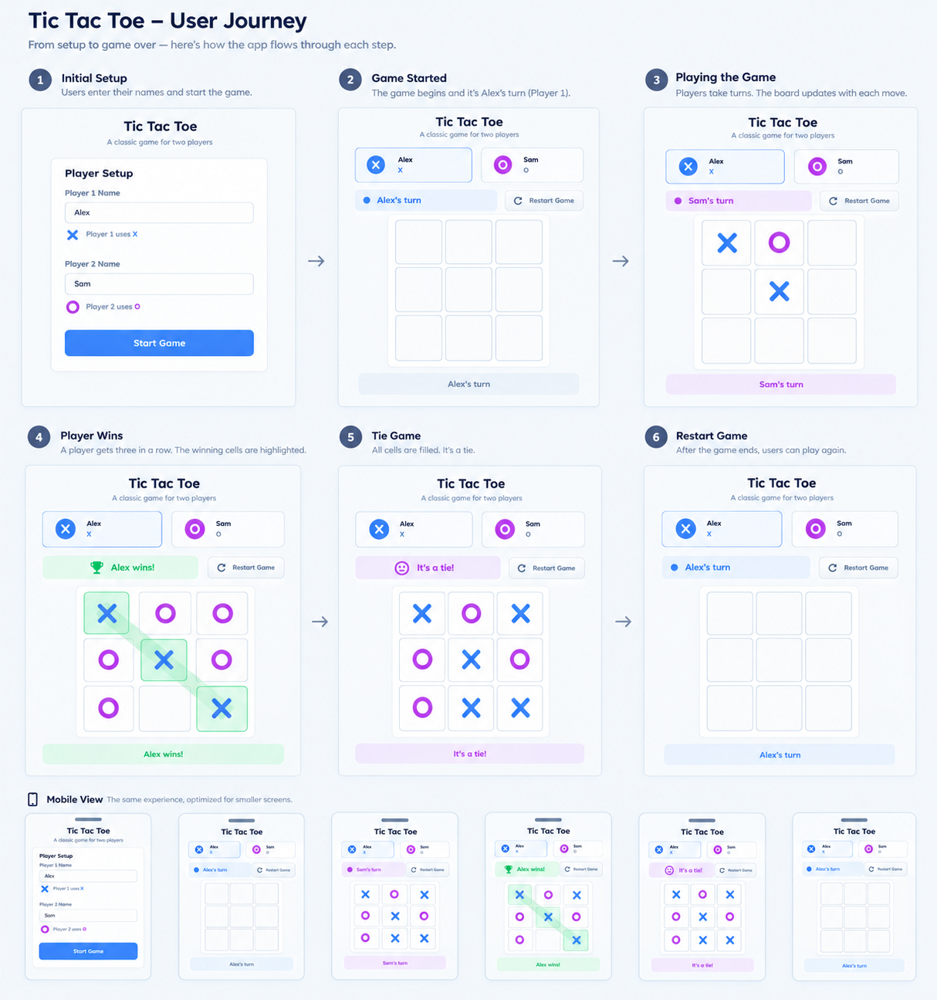

# Tic Tac Toe

A simple browser-based Tic Tac Toe game built as part of [The Odin Project](https://www.theodinproject.com/) JavaScript curriculum.

The goal of this project was to practice structuring JavaScript code using **Factory Functions, the Module Pattern, and closures** while building a complete game.

## Preview



## Live Demo

🔗 **[Play Tic Tac Toe](https://menady0.github.io/odin-tic-tac-toe/)**

## Features

* Two-player local gameplay
* Player name setup
* Turn tracking
* Win detection
* Tie detection
* Game reset
* Dynamic game board
* Game status updates
* Separate game logic and display logic

## How It Works

The game is designed around a few separate responsibilities instead of putting everything into one large script.

### Game Board

The game board is responsible for managing the 3×3 board and the symbols placed on it.

It keeps the board data private and exposes only the functions needed by the rest of the game.

### Players

Players are created using a **Factory Function**, which creates an object containing the player's name and symbol.

### Game Controller

The game controller manages the actual game flow, including:

* Starting and resetting the game
* Keeping track of the current player
* Playing turns
* Checking for a winner
* Checking for a tie
* Keeping track of the game state

### Display Controller

The display controller handles the UI and communicates the current game state to the player.

This keeps the game logic separate from the DOM manipulation as much as possible.

## Project Structure

```text
odin-tic-tac-toe/
│
├── index.html      # Page structure
├── style.css       # Styling and layout
├── script.js       # Game logic and UI logic
├── preview.png     # Project screenshot
└── README.md       # Project documentation
```

## What I Learned

This project was mainly about understanding how to organize JavaScript code rather than just making the game work.

I practiced:

* **Factory Functions**
* **The Module Pattern**
* **Closures**
* Managing private data
* Separating responsibilities between different parts of an application
* Connecting JavaScript logic with the DOM

One thing I struggled with was deciding how to structure the application.

The project doesn't require a particular architecture, but I didn't want to end up with a bunch of functions depending on each other and eventually create spaghetti code.

So I spent quite a bit of time thinking about how the different parts of the game should communicate and how I could keep their responsibilities separate. I also used AI as a tool to discuss different approaches and think through some of the architecture decisions.

## Future Improvements

This version is intentionally a local two-player game, but there are a few things I'd like to explore later when I have more advanced knowledge.

* Add player accounts and signup/login
* Store player statistics such as wins and losses
* Add online multiplayer
* Allow players to create a game and share a link with another player
* Store game history
* Add more detailed player statistics

The idea would eventually be to turn the simple local game into something where two people can play remotely without needing to be in the same room.

## Built With

* HTML
* CSS
* JavaScript

## Part of The Odin Project

This project was built as part of [The Odin Project's JavaScript curriculum](https://www.theodinproject.com/paths/full-stack-javascript/courses/javascript).
